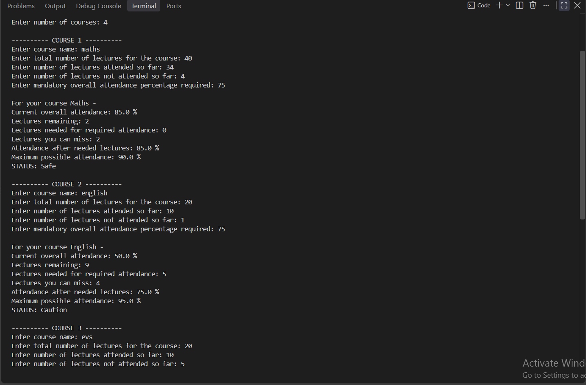
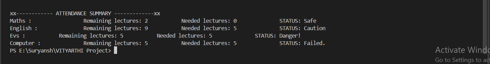

# Attendance Calculator

## Overview

Attendance Calculator is a Python-based command-line application that helps students calculate and monitor their attendance requirements across multiple courses.

The program takes course attendance information as input and determines the number of lectures remaining, the minimum number of lectures that need to be attended, the number of lectures that can still be missed, and the overall attendance status.

The application supports multiple courses and provides a summary of all courses at the end.

---

## Features

- Calculate attendance requirements for multiple courses
- Calculate the number of lectures remaining
- Calculate the minimum number of remaining lectures that need to be attended
- Calculate how many remaining lectures can be missed
- Display current overall attendance percentage
- Display maximum possible attendance
- Classify attendance status as:
  - Safe
  - Caution
  - Danger
  - Failed
- Validate user input
- Handle invalid numerical and percentage inputs
- Display a summary of all entered courses
- Includes a separate testing module for checking calculation and status logic

---

## Technologies Used

- Python 3
- Python standard library
- Command Line / Terminal
- Git and GitHub

No external Python packages are required.

---

## Screenshots

### Main Program

, (Screenshots/Main_1.png)

### Attendance Summary

Attendance-Calculator/
│
├── main.py
├── input_handler.py
├── validators.py
├── attendance_calculator.py
├── status_manager.py
├── summary.py
├── tests.py
├── README.md
├── statement.md
└── .gitignore